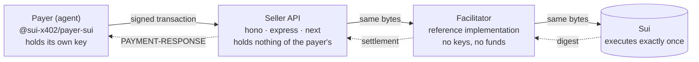
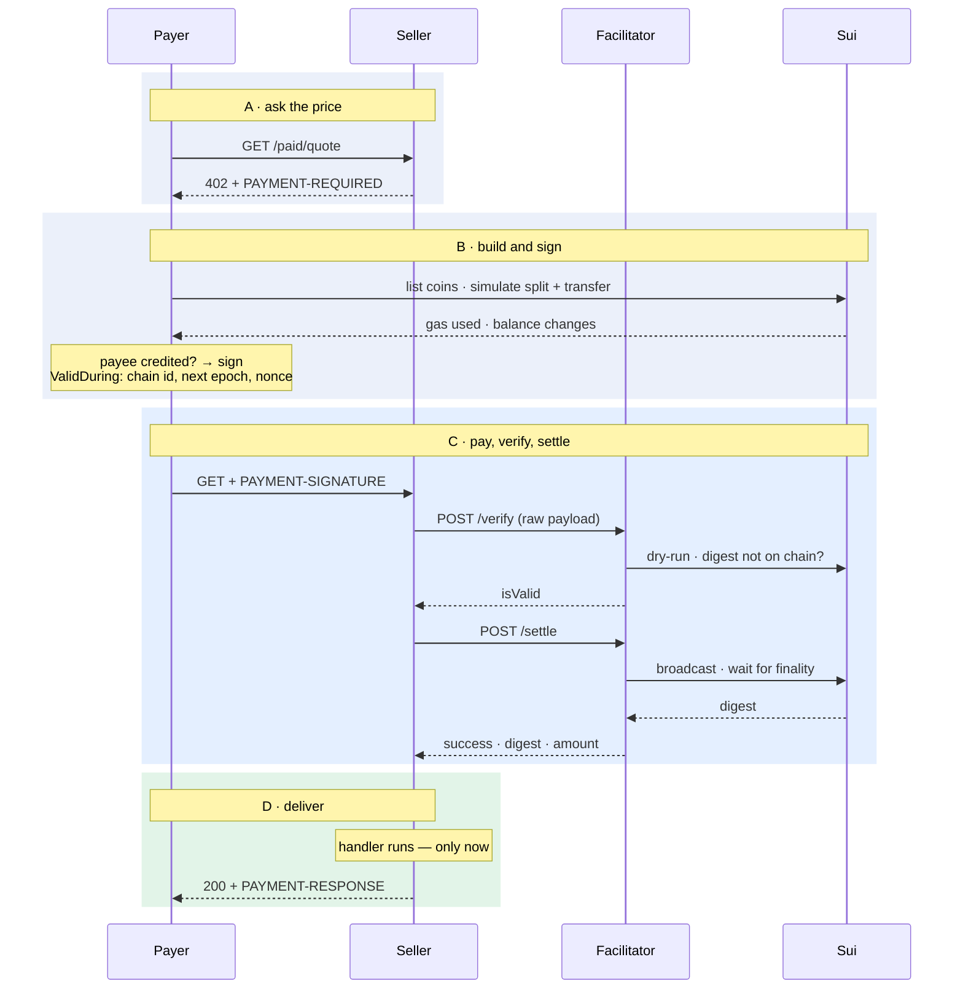
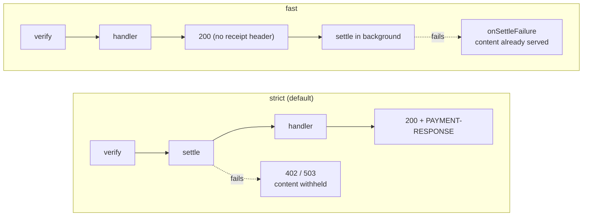
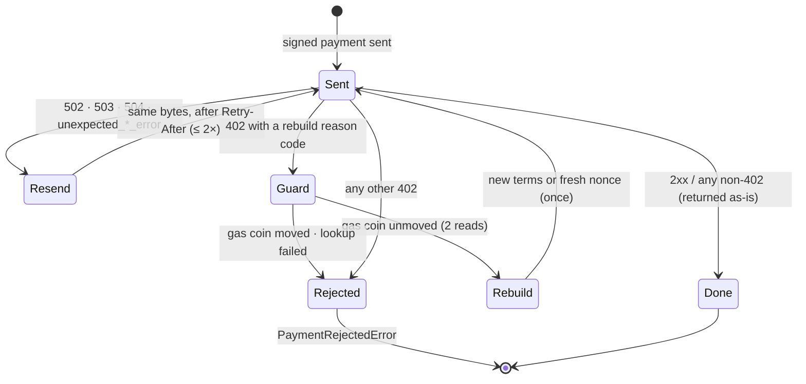

# Concepts

## x402 in one minute

x402 v2 defines two headers and one document.

| Header | Direction | Carries |
|---|---|---|
| `PAYMENT-REQUIRED` | server → client, on a `402` | base64 JSON: the terms (`accepts[]`), the resource, an optional `error` |
| `PAYMENT-SIGNATURE` | client → server, on the retry | base64 JSON: the accepted terms echoed back and the signed payment |
| `PAYMENT-RESPONSE` | server → client, on success | base64 JSON: the facilitator's settlement result (digest, payer, amount) |

On Sui the scheme is `exact`: the payment is a complete, signed Sui transaction
that transfers exactly `amount` of `asset` to `payTo`. The facilitator checks it
by dry-running it and by looking at the simulated balance changes, then
broadcasts the very same bytes.

## The four parties

- **Payer** chooses an offer, builds and signs the transaction, and retries the
  request. It never trusts the seller beyond the schema.
- **Seller** advertises terms, relays the signed payload byte-for-byte, and
  fulfils only after settlement. It never looks inside the transaction.
- **Facilitator** verifies (structure, signature, replay, dry-run, balance
  change) and settles (broadcast, wait for finality). It holds no keys.
- **Sui** executes the transaction exactly once; the digest is the receipt.

## The payment lifecycle

Strict mode, the default.

**A · Ask the price.** `GET /paid/quote` → `402`. The terms are in the
`PAYMENT-REQUIRED` header and, identically, in the JSON body. `accepts[]` lists
one or more offers: scheme, network, amount (atomic units as a string), asset
(full coin type), payee, and `maxTimeoutSeconds`.

**B · Build and sign.** The payer selects the first acceptable offer (server
order wins), discovers its coins over gRPC, composes `merge → split → transfer`
from fully resolved object references, simulates it once to size the gas
budget, checks the simulated balance change credits the payee with at least
the amount, and signs. The transaction carries a `ValidDuring` expiration bound
to the chain identifier and the next epoch, with a random nonce.

**C · Pay, verify, settle.** The payer retries with `PAYMENT-SIGNATURE`. The
seller POSTs `{ x402Version, paymentPayload, paymentRequirements }` to the
facilitator's `/verify`, then `/settle`. The facilitator dry-runs the bytes,
checks the digest is not already on chain, broadcasts, and waits for finality.

**D · Deliver.** The seller's handler runs. The response carries
`PAYMENT-RESPONSE` with the digest. A second plain request is a new `402`.

## Seller responses

| Status | When | Body |
|---|---|---|
| `402` | No `PAYMENT-SIGNATURE`, or the facilitator rejected the payment | The terms document; `error` holds the reason (`"PAYMENT-SIGNATURE header is required"` or a reason code such as `insufficient_funds`) |
| `400` | The header is present but unreadable | `{ "error": "malformed PAYMENT-SIGNATURE", "reason": "not_base64" \| "not_json" \| "schema" \| … }` |
| `503` + `Retry-After` | The facilitator is unreachable, slow, answered 5xx, or answered something unparseable | `{ "error": "facilitator unavailable", "kind": "unreachable" \| "timeout" \| "http" \| "unparseable" }` |
| `200` (your handler) | Settled | Your response + `PAYMENT-RESPONSE` |

Most reason codes are the facilitator's (`invalid_payment_requirements`,
`invalid_transaction_state`, `insufficient_funds`, `unexpected_settle_error`,
…). `@sui-x402/core` exports them as `ReasonCode` and maps each to a
`retryHint`: `refetch_terms`, `rebuild_tx`, `facilitator`, or `none`.

One reason comes from the seller rather than the facilitator:
`settlement_mismatch`, reported to `onSettleFailure` when a settlement the
facilitator called successful does not match the offer the seller made (see
below).

## Strict vs fast

| | Strict (default) | Fast |
|---|---|---|
| Order | verify → settle → handler | verify → handler → settle |
| Payer waits for | finality | the dry-run only |
| Settlement failure | content withheld, `402` | content already served; reported to `onSettleFailure` |
| Settlement that does not match the offer | content withheld, `402` | content already served; `onSettleFailure` with `settlement_mismatch` |
| `PAYMENT-RESPONSE` | yes | no — the outcome reaches `onSettled` / `onSettleFailure` only |
| Risk | none beyond the chain's | the payer's coins can be spent elsewhere between verify and settle |

Use strict for anything you would not give away. On serverless hosts that
freeze a function after the response, fast mode may never settle — use strict.

A settlement is only accepted when it matches the offer: the settled network
must equal the offer's, and any amount the facilitator reports must be at
least the amount asked for. A `success: true` that fails either check is
treated exactly like a failure. Note the settle response carries no `payTo`,
so this cannot confirm *who* was paid — that binding is the facilitator's
responsibility.

## Idempotency and retries

The facilitator deduplicates settlement by transaction digest: the same signed
bytes always resolve to the same outcome, even across a facilitator restart.
This is what makes a `503` safe — the payer resends the identical payload after
`Retry-After`, and at worst it gets the original result.

The payer will sign a **second, different** payment at most once per call, and
only when:

- the seller says the terms drifted (`invalid_payment_requirements`) — the
  payer re-reads the new terms; or
- the seller says the transaction went stale (`invalid_transaction_state`) —
  the payer rebuilds with a fresh nonce;

and in both cases only after reading the first payment's gas coin twice,
1.5 seconds apart, at the version it was signed with. Any execution of a Sui
transaction moves its gas coin, so an unmoved coin proves the first payment
never ran. A moved coin, or a failed lookup, ends the call with
`PaymentRejectedError`. Transaction lookups are deliberately not used for this:
a full node answers "not found" for pruned history too.

A `402` carrying `unexpected_verify_error` / `unexpected_settle_error`, or a
`502`/`503`/`504`, is treated as a facilitator outage: resend the same bytes,
up to twice, honouring `Retry-After` (capped at 30 s).

What the payer does with the answer to a paid request:

## Expiry

Sui does not yet support timestamp-based transaction expiry (the node rejects
it), so `maxTimeoutSeconds` cannot be enforced on chain at second granularity.
Instead every payment is bound to the **next epoch**: an unsettled payment dies
with it, and a rebuilt payment is a new transaction rather than a replay.
`maxTimeoutSeconds` remains a local deadline — a payment whose window closed
before it could be sent is rebuilt once.

## Chain identity

An offer names a network (`sui:testnet`); a client is configured with a URL.
Nothing ties the two together, so the payer compares the node's genesis
checkpoint digest (`getChainIdentifier`) with a pinned table before touching a
coin. Only `sui:testnet` is pinned; paying on any other network requires the
integrator to supply its digest explicitly.

## Money and assets

Amounts are atomic-unit strings on the wire and `bigint` in code — never
floats. USDC has 6 decimals (`"10000"` = $0.01), SUI has 9. Assets are full
coin types (`0x…::usdc::USDC`), compared after `normalizeStructTag`; symbols
are never trusted. Addresses are compared after `normalizeSuiAddress`, but the
seller's offer is echoed back exactly as received — the facilitator normalises
on its side.
