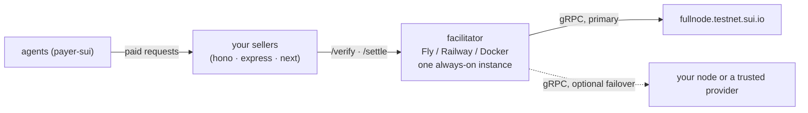

# Facilitator runbook — self-hosting the reference facilitator

We do not write facilitator logic. This runbook deploys
[`DrVelvetFog/sui-x402-facilitator`](https://github.com/DrVelvetFog/sui-x402-facilitator)
**unmodified** (Apache-2.0), pinned as a git submodule at
`deploy/facilitator/upstream` — see `deploy/facilitator/UPSTREAM.md` for the
commit hash and update procedure.

Why self-host: the author's instance (`https://sui-facilitator.onrender.com`)
is a free-tier Render box run by one person. Fine for dev/beta; production
sellers point at their own deployment. This repository's own
instance, deployed from this config to Railway, runs at
`https://facilitator-production-1e79.up.railway.app` (testnet).

## What you get



```
GET  /supported   -> { kinds: [{ x402Version, scheme, network, extra: { usdc, decimals } }], extensions, signers }
POST /verify      -> { isValid, invalidReason?, payer? }
POST /settle      -> { success, errorReason?, payer?, transaction, network, amount? }
GET  /health      -> { ok, service, networks, custody, fees, terms, uptimeSeconds }
```

Non-custodial: it simulates (verify) or broadcasts verbatim (settle) the
payer's own signed transaction. No keys unless you opt into the Enoki gas
station. Semantic failures are HTTP 200 with `isValid:false` /
`success:false`; 400 only for unparseable bodies; 429 when rate-limited.

## Files

| path                              | purpose                                                                         |
| --------------------------------- | ------------------------------------------------------------------------------- |
| `deploy/facilitator/upstream/`    | submodule, read-only for us                                                     |
| `deploy/facilitator/Dockerfile`   | `node:22-alpine`, `npm ci --omit=dev`, runs `tsx src/index.ts` as upstream does |
| `deploy/facilitator/.env.example` | every env var upstream reads                                                    |
| `deploy/facilitator/fly.toml`     | Fly.io app manifest                                                             |
| `deploy/facilitator/railway.json` | Railway service config                                                          |
| `deploy/facilitator/smoke.mjs`    | local smoke test (starts server, checks `/health` + `/supported`)               |

## Prerequisites

- Node 22+ and Docker (for the image); `flyctl` or the Railway CLI for deploys
- Submodule initialised: `git submodule update --init deploy/facilitator/upstream`
- Optional, recommended for production: a second trusted gRPC endpoint for
  failover (see next section)

## gRPC endpoints and failover

`SUI_TESTNET_RPC` is a comma-separated list, first = primary. Upstream's
`FailoverRpc` retries the next endpoint on transport errors (timeout,
unavailable, network) and never on deterministic gRPC statuses (`NOT_FOUND`,
`INVALID_ARGUMENT`, …), so a protocol rejection is reported truthfully
instead of hidden by failover. Public JSON-RPC was retired in July 2026;
these must be **gRPC** endpoints.

Verification trusts whatever the node answers (dry-run result, balance
changes, digest lookup for the replay guard). A malicious or buggy endpoint
could validate a bad payment. Therefore:

1. Primary: Mysten's official `https://fullnode.testnet.sui.io:443`.
2. Secondary (optional): your own full node, or a provider you trust that
   serves Sui gRPC. `.env.example` / `fly.toml` ship the single official
   entry (no failover); append a comma-separated second endpoint for
   production rather than an untrusted one.

## Run locally

### Node (fastest)

```sh
cd deploy/facilitator/upstream
npm ci
PORT=4402 npm run serve
# other terminal
curl -s localhost:4402/supported | jq
```

### Smoke test (what CI and the runbook mean by "it works")

```sh
node deploy/facilitator/smoke.mjs            # starts upstream on a free port, checks /health and /supported, exits 0/1
node deploy/facilitator/smoke.mjs --save     # also writes packages/core/fixtures/facilitator-supported.local.json
```

`--save` always writes that testnet-pinned fixture and refuses to run against
a mainnet-enabled facilitator. Never use it to capture a mainnet `/supported`
— if a mainnet-enabled local capture is ever genuinely wanted, it goes to a
**new** fixture file, `packages/core/fixtures/facilitator-supported.local-mainnet.json`,
with its own test assertion, never by overwriting `.local.json`.

### Docker

```sh
cd deploy/facilitator
docker build -t sui-x402-facilitator .
docker run --rm -p 4402:4402 --env-file .env sui-x402-facilitator
curl -s localhost:4402/health
```

## Deploy — Fly.io

```sh
cd deploy/facilitator                          # build context must contain ./upstream
fly launch --no-deploy --copy-config --name <your-app-name>   # first time only; keeps fly.toml
fly secrets set SUI_TESTNET_RPC="https://fullnode.testnet.sui.io:443"   # append ,https://<second-trusted-grpc>:443 for failover
fly deploy
fly status && curl -s https://<your-app-name>.fly.dev/supported | jq
```

`fly.toml` pins one always-on machine (`auto_stop_machines = "off"`,
`min_machines_running = 1`) — see "Operating notes" for why. Secrets set via
`fly secrets` override `[env]` values of the same name.

## Deploy — Railway

1. New project → "Deploy from GitHub repo" → pick this repo.
2. Service settings → **Root Directory** = `deploy/facilitator`. Railway
   reads `railway.json` there and builds the `Dockerfile`.
3. Submodules are not fetched by Railway's builder; the Dockerfile clones the
   pinned upstream commit itself, so no extra setting is needed.
4. Variables: paste the contents of `.env.example` except `PORT` — Railway
   injects its own and the app honours it. If you do set `PORT`, make the
   domain's target port match it.
5. Deploy, then `curl -s https://<service>.up.railway.app/supported`.

`railway.json` pins `numReplicas: 1` and the `/health` check.

## Configuration

| env                        | default           | notes                                                                |
| -------------------------- | ----------------- | -------------------------------------------------------------------- |
| `PORT`                     | `4402`            | Fly/Railway inject their own; upstream reads it                      |
| `SUI_TESTNET_RPC`          | official fullnode | comma-separated gRPC failover list                                   |
| `SUI_MAINNET_RPC`          | official fullnode | only read when `ENABLE_MAINNET=1`                                    |
| `ENABLE_MAINNET`           | unset             | off by default, see "Mainnet"                                        |
| `RPC_TIMEOUT_MS`           | `20000`           | per-call timeout before failover                                     |
| `RATE_LIMIT`               | `120`             | requests per IP per minute (keyed on the last `x-forwarded-for` hop) |
| `ENOKI_KEY`                | unset             | enables `/gas-station` routes; sponsor key pays gas only             |
| `SPONSOR_DAILY_CAP`        | `60`              | sponsored txs per sender per day                                     |
| `SPONSOR_GLOBAL_DAILY_CAP` | `1000`            | sponsored txs per day, all senders                                   |

## Operating notes

- **Exactly one instance.** Settle idempotency (in-flight promise cache keyed
  by digest), rate-limit buckets and sponsorship counters are in-process
  `Map`s. Two replicas would each see a "first" settle. Chain-level
  protections (digest uniqueness, consumed coin objects) still make a double
  broadcast fail closed, but you would lose the clean single-broadcast
  guarantee and the 429 accounting. Scale vertically or add a shared store
  upstream first.
- **Restarts are safe.** After a restart, a settle retry finds the digest
  on-chain and reconstructs the original outcome from execution truth.
- **Keep it warm.** A cold start on Fly/Railway is a few seconds of
  `tsx` boot; sellers in strict mode block the response on `/settle`, so
  scale-to-zero shows up as payer-visible latency. Config already disables it.
- **Fails closed on RPC outage.** If every endpoint is unreachable the replay
  guard throws rather than treating "unknown" as "not executed"; `/verify`
  returns `isValid:false` with an `unexpected_verify_error` reason. Seller
  middleware should respond 503 + `Retry-After`.
- **Logs** are stdout (`fly logs` / Railway log tab). Transport failovers log
  `rpc endpoint N failed (...); trying next`.
- **Body cap** 256 KB; signed payment txs are 2–6 KB.

## Upgrading upstream

Follow `deploy/facilitator/UPSTREAM.md`, then `node deploy/facilitator/smoke.mjs`,
then redeploy. If `/supported` changed shape, refresh
`packages/core/fixtures/` and re-run `pnpm test` — core's schemas are derived
from those fixtures.

## Mainnet

Off by default and never enabled by tooling. This section is the hardening
review that `deploy/facilitator/.env.example` points at — every box below is
required before `ENABLE_MAINNET=1` is set on any deployment.

### Config surface

| env                | effect                                                                                      | where it may live    |
| ------------------ | ------------------------------------------------------------------------------------------- | -------------------- |
| `ENABLE_MAINNET=1` | flips the facilitator's network registry to advertise `sui:mainnet` alongside `sui:testnet` | platform secret only |
| `SUI_MAINNET_RPC`  | comma-separated gRPC failover list, first entry primary                                     | platform secret only |

Neither var may be committed to `.env.example`, `fly.toml`, or `railway.json`.

`SUI_MAINNET_RPC` has two silent-failure modes — get either wrong and the
service still starts and still passes a casual smoke test:

- **Unset** is not "no mainnet RPC": it falls back to a single public
  default endpoint — a no-failover mainnet service that passes every other
  check below.
- **Empty string** is not the same as unset: it yields zero endpoints.

### Hardening checklist

Check every box before setting `ENABLE_MAINNET=1`.

1. **Pinned commit reviewed, and the pin is in lockstep.** Read the exact
   submodule commit at `deploy/facilitator/upstream/` — verify, settle,
   replay/idempotency, and broadcast paths, not the upstream default
   branch. Record the reviewed SHA, then confirm the three places this
   repo records it agree: `git submodule status deploy/facilitator/upstream`,
   the `ARG UPSTREAM_COMMIT` literal in `deploy/facilitator/Dockerfile`, and
   the "Pinned commit" row in `deploy/facilitator/UPSTREAM.md`. The
   Dockerfile literal is hand-maintained and is what the deployed image
   actually runs — a drift here means you reviewed one commit and shipped
   another.
2. **Upstream claims checked.** Read upstream's README "Networks & assets"
   and `PROOF.md`; confirm the pinned commit is the one those documents
   describe.
3. **Mainnet asset confirmed** against two independent sources, including
   on-chain coin metadata showing `decimals` 6. To re-run the on-chain half:
   `node packages/payer-sui/coin-metadata.mjs <coinType> <baseUrl> <baseUrl>`.

   > **Confirmation record** (confirmed 2026-09-01, issue #6):
   >
   > - Date: 2026-09-01
   > - Source A: Circle's official "USDC contract addresses" page
   >   (developers.circle.com/stablecoins/usdc-contract-addresses), Sui
   >   mainnet row — read directly by the owner, independently re-fetched
   >   in-session.
   > - Source B: on-chain coin metadata via gRPC `GetCoinInfo` from two
   >   independent mainnet full nodes (`fullnode.mainnet.sui.io` and
   >   `sui-grpc.publicnode.com`, both reporting mainnet chain id
   >   `4btiuiMPvEENsttpZC7CZ53DruC3MAgfznDbASZ7DR6S`): the coin type
   >   exists, `decimals` is 6, both nodes return the same metadata object
   >   (`0x75cf…2b4a`) naming USDC as a Circle-issued regulated stablecoin.
   >   Queries were agent-executed at the owner's direction.
   >
   > Both sources and the pinned facilitator config
   > (`deploy/facilitator/upstream/src/config.ts`, `mainnet.usdc`) are
   > identical after `normalizeStructTag`. Per issue #6's acceptance
   > criteria the coin type string itself is deliberately not copied here —
   > the pinned config remains the single in-repo copy.

4. **RPC endpoints trusted — and actually configured.** `SUI_MAINNET_RPC`
   holds two endpoints you control or independently trust — never a
   community aggregator or an unauthenticated public proxy chosen for
   convenience. Verification trusts whatever the node answers (dry-run
   result, balance changes, digest lookup), so a hostile endpoint can
   falsely validate a payment. Confirm in the deployment platform's own
   secret list — not just a local `.env` — that the var is set, non-empty,
   and holds two comma-separated entries.

   Protocol constrains the choice as much as trust does: most Sui gRPC
   endpoints cannot be used here at all, because the facilitator can send
   only a base URL and speaks gRPC-Web. What works is a self-hosted
   fullnode, a provider that accepts its key as a URL path segment, or a
   header-only provider behind the proxy in `deploy/rpc-proxy/`. Chainstack
   accepts the key in the path — `https://<host>/<key>`, verified through
   `SuiGrpcClient` — so it needs no proxy. See [D16](decisions.md).

   The key belongs in `SUI_MAINNET_RPC` as a platform secret and nowhere
   else. It is safe from the facilitator's own logs (failover is logged by
   endpoint index, and transport errors name only the host), but treat the
   whole variable as secret and never echo it in a shell that logs.

   Verify rather than assume — the facilitator logs a failover only when
   one happens, so a broken second endpoint stays invisible until the
   primary dies:

   ```sh
   node deploy/verify-rpc-endpoints.mjs mainnet "$SUI_MAINNET_RPC"
   ```

   Every endpoint must report PASS.

5. **Separate service.** Mainnet runs as its own deployment: its own URL,
   its own secrets, its own logs.
6. **Rate limit and RPC timeout reviewed** for mainnet traffic — sized for
   mainnet, not copied from testnet defaults.
7. **No key material.** (a) Confirm in the platform's own secret list that
   `ENOKI_KEY`, `SPONSOR_DAILY_CAP`, and `SPONSOR_GLOBAL_DAILY_CAP` are
   **unset** on the mainnet service. (b) Prove it at the edge: `POST
/gas-station` and `POST /gas-station/execute` must both return **HTTP
   503** with body `{"error": "sponsorship not configured"}`. Sponsorship
   stays off for v1.
8. **Health check and alerting live** on the mainnet service before it
   takes traffic, including an alert on settle failures.

   Railway cannot do the settle-failure half natively — it has no
   log-content alerting, no log drain and no sidecars — so the match has to
   happen in-container. `deploy/facilitator/alerting/` holds two ready
   options and the exact lines to alert on; follow its README.

   An untested alert path is not an alert path: emit one synthetic
   matching line on the deployed service and confirm the alert arrives
   before this box is checked.

9. **Rollback rehearsed.** Unset `ENABLE_MAINNET`, redeploy, and confirm
   `/supported` returns to testnet-only. Then confirm a `sui:mainnet` `POST
/settle` fails cleanly rather than hanging: HTTP **200** with
   `{"success": false, "errorReason": "invalid_network", "transaction": "",
"network": "sui:mainnet"}`. The request body must be well-formed enough
   to reach that check — `x402Version: 2` on both the envelope and
   `paymentPayload`, `paymentRequirements.scheme: "exact"`,
   `paymentRequirements.network: "sui:mainnet"`, and a non-empty, decodable
   `payload.transaction` (a spent testnet transaction works fine; the
   request never reaches a chain). A missing or undecodable `transaction`
   yields `invalid_payload`, not `invalid_network` — that's a malformed
   rehearsal, not a rollback signal. Don't look for a 4xx: semantic
   failures on this facilitator are always HTTP 200.
10. **Post-enable registry check (semantic, not byte-wise).** `curl
/supported | jq` on the mainnet service: the kinds set is exactly
    `["sui:testnet", "sui:mainnet"]`, and the mainnet kind's `extra.usdc`
    equals the tag confirmed in item 3 exactly. `extra.decimals` proves
    nothing here (see below) — the decimals claim is only proven in item 3,
    against on-chain coin metadata.
11. **Deployed commit identity, proven where it's actually provable.**
    Establish one chain of equalities: the SHA reviewed in item 1 == `git
submodule status deploy/facilitator/upstream` == the `ARG
UPSTREAM_COMMIT` literal in `deploy/facilitator/Dockerfile` ==
    `deploy/facilitator/UPSTREAM.md`'s pinned-commit row == the commit
    shown in the deploy platform's build log / image digest for the
    running service. `/supported` cannot serve this purpose — see below.

### What `/supported` cannot prove

- **Commit identity.** `supported()` is a pure function of the enabled
  network list and the two coin constants, so its output is identical
  across every commit that leaves the config file alone. No fixture diff
  is possible either: the server serialises compact JSON, the smoke
  script writes pretty-printed.
- **`extra.decimals`** — an unconditional literal for every network.
- **`signers`** — an unconditional empty map.

None of these three are evidence about a coin or about key material.

### Mainnet USDC asset

The mainnet USDC struct tag is not restated here. The single source is
`deploy/facilitator/upstream/src/config.ts` (the `MAINNET.usdc` field) —
confirm item 3 against that file, not against a copy of it.

## Troubleshooting

| symptom                                                 | likely cause                                                                                                          |
| ------------------------------------------------------- | --------------------------------------------------------------------------------------------------------------------- |
| build fails: `upstream/package.json` not found          | submodule not initialised / platform skipped submodules                                                               |
| `/supported` lists only `sui:testnet`                   | expected unless `ENABLE_MAINNET=1`                                                                                    |
| `/verify` → `unexpected_verify_error` for every request | all gRPC endpoints unreachable or not gRPC (JSON-RPC URL?)                                                            |
| 429 on `/verify`                                        | `RATE_LIMIT` per IP per minute; behind a proxy make sure the platform appends the real client IP to `x-forwarded-for` |
| `/gas-station` → 404                                    | `ENOKI_KEY` unset (by design for v1)                                                                                  |
