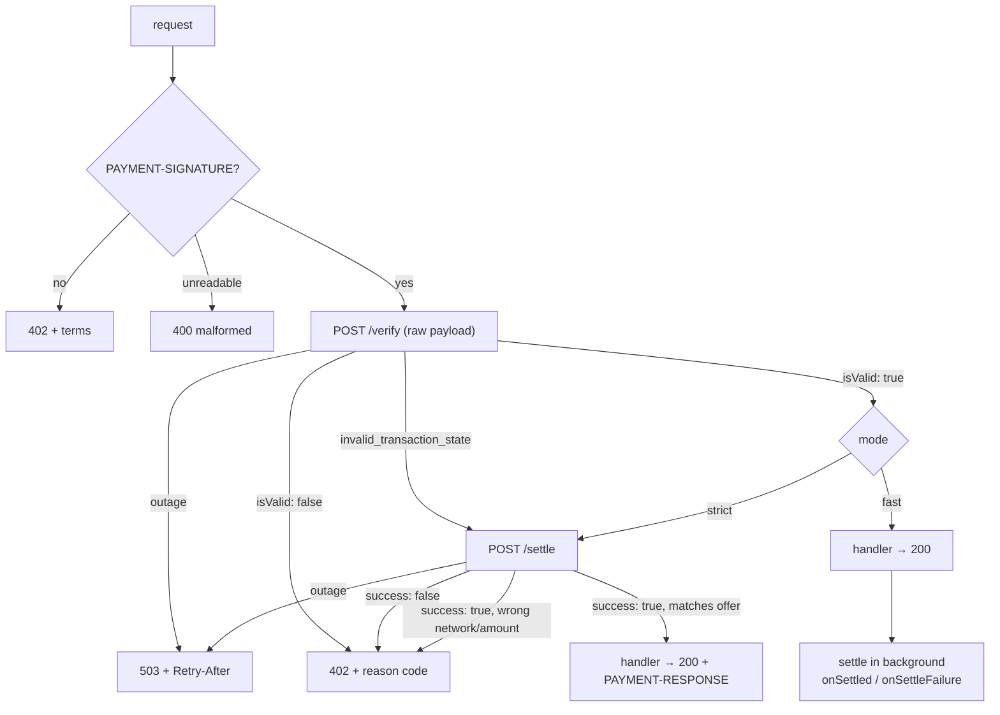

# Guide: make an API payable

Three adapters, one behaviour. Pick the one for your framework; the options and
the responses are identical because every decision is made by `createSeller` in
`@sui-x402/core`.

## Install

```sh
pnpm add @sui-x402/hono        # or @sui-x402/express, @sui-x402/next
```

## Configure the seller

```ts
import { createSeller } from "@sui-x402/core";   // re-exported by each adapter

const seller = createSeller({
  payTo: process.env.PAY_TO!,                     // your Sui address
  amount: "10000",                                // atomic units: 0.01 USDC
  asset: "0xa1ec7fc00a6f40db9693ad1415d0c193ad3906494428cf252621037bd7117e29::usdc::USDC",
  network: "sui:testnet",
  facilitator: process.env.FACILITATOR_URL!,      // your self-hosted facilitator
  description: "A SUI price quote, paid per request",
  mimeType: "application/json",
});

await seller.assertFacilitatorSupports();         // at boot: fails loudly if the facilitator does not serve your network
```

| Option | Default | Meaning |
|---|---|---|
| `payTo` | — | Recipient address. Validated at construction. |
| `amount` | — | Atomic units, base-10 string, positive. Never a float. |
| `asset` | — | Full coin type. Validated by shape; match by struct tag, never symbol. |
| `network` | — | `sui:testnet` or `sui:mainnet`. Mainnet throws unless `allowMainnet: true`. |
| `facilitator` | — | Base URL of the facilitator (`/verify`, `/settle`, `/supported`). |
| `mode` | `"strict"` | `strict` settles before your handler runs; `fast` settles after. See [Concepts](../concepts.md#strict-vs-fast). |
| `maxTimeoutSeconds` | `60` | Advertised payment window; the facilitator waits this long for finality. |
| `retryAfterSeconds` | `5` | `Retry-After` on a `503`. |
| `verifyTimeoutMs` | `10000` | Timeout for `/verify` and `/supported`. |
| `settleTimeoutMs` | `maxTimeoutSeconds × 1000 + 10000` | Timeout for `/settle`. |
| `allowMainnet` | `false` | Explicit opt-in for `sui:mainnet`. |
| `onSettled` | — | Called with the `SettleResponse` after a settlement that succeeded *and* matched the offer (both modes). |
| `onSettleFailure` | — | Called with `{ reason, payer, digest }` when settlement fails, or when it succeeds but does not match the offer — `reason` is then `settlement_mismatch` (both modes). |
| `fetch` | `globalThis.fetch` | Injected in tests. |

Misconfiguration throws `SellerConfigError` naming the field, at startup, not
on the first paid request.

## Hono

```ts
import { Hono } from "hono";
import { serve } from "@hono/node-server";
import { x402 } from "@sui-x402/hono";

const app = new Hono();
app.use("/paid/*", x402(seller));                 // or x402({ ...options })
app.get("/paid/quote", (c) => c.json({ symbol: "SUI", quote: "1.00" }));

serve({ fetch: app.fetch, port: 8402, serverOptions: { maxHeaderSize: 262144 } });
```

Register the middleware before the routes it guards; Hono runs handlers in
registration order.

## Express

```ts
import express from "express";
import http from "node:http";
import { x402 } from "@sui-x402/express";

const app = express();
app.get("/paid/quote", x402(seller), (req, res) => res.json({ symbol: "SUI", quote: "1.00" }));

http.createServer({ maxHeaderSize: 262144 }, app).listen(8402);
```

In fast mode Express cannot attach `PAYMENT-RESPONSE` (headers are already out
when settlement starts); the outcome reaches `onSettled` / `onSettleFailure`.

## Next.js (App Router)

```ts
// app/api/quote/route.ts
import { withX402 } from "@sui-x402/next";
import { seller } from "../../../lib/seller";

export const runtime = "nodejs";                  // the header codec needs Buffer; the edge runtime has none

export const GET = withX402(seller)(async () => Response.json({ symbol: "SUI", quote: "1.00" }));
```

Wrap route handlers, not `middleware.ts` (it runs on the edge). Start Next with
`NODE_OPTIONS=--max-http-header-size=262144`.

## What the payer sees


How the seller decides, per request:



| Status | Meaning for the payer |
|---|---|
| `402` + `PAYMENT-REQUIRED` | Pay these terms. The document's `error` field carries either the "header is required" message or the facilitator's reason code. |
| `400` | The `PAYMENT-SIGNATURE` header was unreadable (`reason` says why). |
| `503` + `Retry-After` | Facilitator outage. Resend the same payment later; the facilitator dedupes by digest. |
| `200` + `PAYMENT-RESPONSE` | Paid. The header decodes to the settlement (`transaction` digest, `payer`, `amount`). |

## Header size

A signed payment is up to 120 KB of base64 in one request header, far above
Node's 16 KiB default. Raise it on every server in front of the middleware:
`maxHeaderSize: 262144` on `http.createServer` / `@hono/node-server`, or
`NODE_OPTIONS=--max-http-header-size=262144`. A proxy in front (nginx, a load
balancer) needs the same.

## Test your integration

The shared conformance suite in `packages/core/test/seller-conformance.ts`
drives any adapter through 13 scenarios — missing header, malformed header,
facilitator rejections, outages at verify and at settle, strict and fast
settlement, the already-settled retry — over a scripted facilitator. The three
shipped adapters run it; a custom adapter can too.

## Run the examples

```sh
cp examples/hono-server/.env.example examples/hono-server/.env   # set PAY_TO, FACILITATOR_URL
pnpm --filter example-hono-server dev
curl -i localhost:8402/paid/quote                                # 402 + PAYMENT-REQUIRED
```

`examples/express-server` and `examples/next-paywall` are the same app in the
other two frameworks. Each has an `E2E=1` test that pays itself with the payer.
