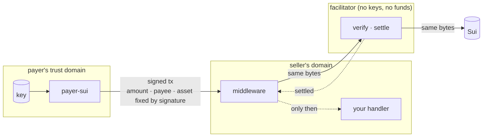

# Security model

## Trust boundaries

| Party | Holds | Can do | Cannot do |
|---|---|---|---|
| Payer | its own key, its coins | choose which offers to pay, cap spend | be made to pay more than it signed |
| Seller | nothing of the payer's | advertise terms, relay, withhold content | alter the payment, settle without the facilitator |
| Facilitator | no keys, no funds | dry-run, broadcast, dedupe | redirect funds, change the amount |
| Sui | the ledger | execute once | execute a transaction twice |

The signed transaction is the security object. Its amount, recipient and asset
are fixed by the signature; its chain and epoch are fixed by the expiration; its
digest is fixed by its bytes.

## What the payer defends against

**A seller that lies about the terms.** Selection rules (`networks`, `assets`,
`maxAmount`) are applied before anything is built; anything outside them is
rejected with a reason list. `sui:mainnet` is never implicit.

**A client pointed at the wrong chain.** The node's genesis checkpoint digest
must match the offer's network; otherwise `network_mismatch`, before any coin
is read for spending.

**A mis-built transaction.** The payer simulates before signing and checks that
the simulated balance change credits the payee with at least the amount —
the same rule the facilitator applies. Gas is sized from that simulation with
headroom and capped (`maxGasBudget`, default 1 SUI); the gas coins simulated
are the gas coins signed, so the estimate is the real cost.

**Being made to pay twice.** The facilitator deduplicates by digest, so
resending the same bytes is safe. Signing different bytes is not, so a second
payment is issued at most once per call, only on a reason code that means the
first was refused, and only after the first payment's gas coin is read twice
at its signed version — a transaction that executed, successfully or not,
moves its gas coin. "Transaction not found" is never treated as proof: full
nodes answer that for pruned history too.

**A hostile or buggy `402` after payment.** An unreadable `PAYMENT-REQUIRED`
on the retry, an oversized body (capped at 256 KiB), or a settlement naming a
foreign digest never lose the paid response: the caller gets the `Response`
and `sent`, and a `receipt` only when it is consistent.

**Key leakage.** Keys are read from the environment; error messages never
include the input; the signed payload is never logged by the SDK.

## What the seller defends against

**Serving unpaid.** In strict mode the handler cannot run before `/settle`
succeeds. Every facilitator failure mode — unreachable, timeout, 5xx,
unparseable body — is a `503` with `Retry-After`, never a pass-through.

**Tampering accusations.** The payload is relayed as the raw parsed JSON the
payer sent, not a schema-normalised copy, so the facilitator judges exactly
the bytes the payer signed.

**Configuration drift.** `createSeller` validates address, amount, asset,
network, URL and timeouts at startup; `assertFacilitatorSupports()` confirms
the facilitator serves the configured network before the first request.

**Oversized headers.** The middleware validates base64, size (256 KiB header,
120 KB transaction) and schema before anything is forwarded.

## What the facilitator does (and why it is reused)

Structure check (including `accepted` = `paymentRequirements`), signature
check with signer = sender, replay check by digest on chain, dry-run, balance
change ≥ amount, then broadcast and wait for finality; settlement is
idempotent per digest, including after a restart. These are the parts where a
bug loses money, which is why this repo vendors the reference implementation
at a pinned commit instead of rewriting it, and ships only its deployment.

## Residual risks

- **Replica skew.** The two gas-coin reads that gate a second payment could both
  hit a lagging replica of a load-balanced node. The single-rebuild budget and
  the reason-code gate bound the damage to one extra payment.
- **Fast mode.** Between verify and settle the payer's coins can be spent
  elsewhere; content already served is then unpaid. Strict mode is the default
  and the recommendation.
- **Epoch window.** On-chain expiry is the next epoch (24–48 h on testnet), not
  `maxTimeoutSeconds`; the network does not support timestamp expiry yet.
- **Unexercised paths.** Rebuilds, fast mode and fragmented wallets are covered
  by unit tests against mocked gRPC, not by live runs.

Reporting: open an issue on the repository. Do not include signed payloads or
keys in reports.
